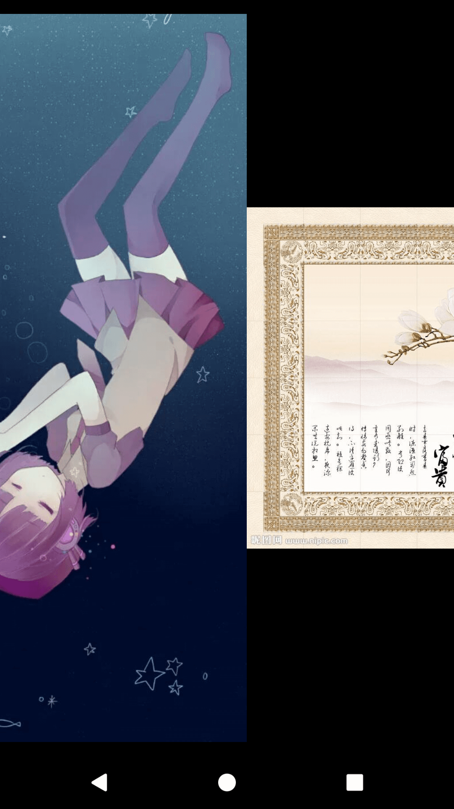
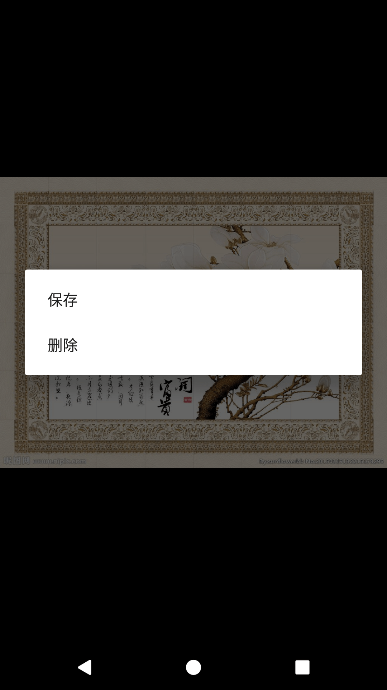
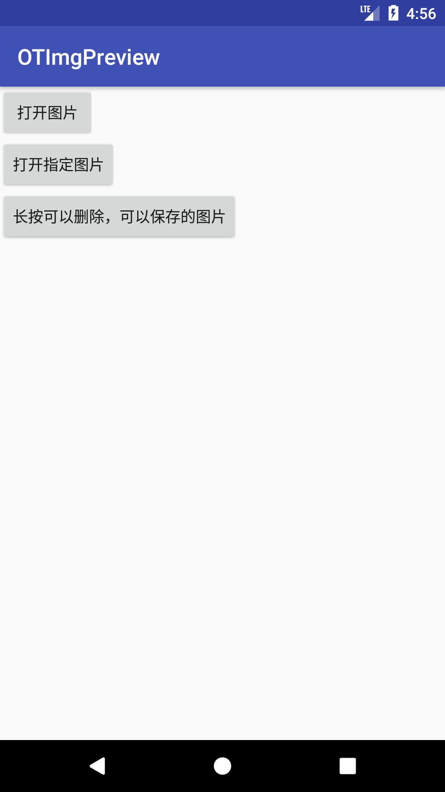

# OTImgPreview

Android 多图预览

For [旧时光](http://jiushig.com)

## Screenshot 
  
   
  


## Setup

To use this library your `minSdkVersion` must be >= 19

Add it in your root build.gradle at the end of repositories

```gradle
allprojects {
    repositories {
        ...
        maven { url 'https://www.jitpack.io' }
    }
}
```
Add the dependency
```gradle
dependencies {
        compile 'com.github.xia-weiyang:OTImgPreview:1.0'
}
```

## Usage

```java
new ImageBuilder(activity)
        .setUrls(urls)
        .setCurrentUrl(url)
        .setSavePath(path)
        .start();
```

Look at the sample app for more.

# License

```
Copyright (C) 2015 Thomas Bruyelle

Licensed under the Apache License, Version 2.0 (the "License");
you may not use this file except in compliance with the License.
You may obtain a copy of the License at

   http://www.apache.org/licenses/LICENSE-2.0

Unless required by applicable law or agreed to in writing, software
distributed under the License is distributed on an "AS IS" BASIS,
WITHOUT WARRANTIES OR CONDITIONS OF ANY KIND, either express or implied.
See the License for the specific language governing permissions and
limitations under the License.
```
